<!-- cairn-nav:start -->
<p align="center"><b>Cairn is a family of five repositories.</b> Each builds, tests and releases on its own; they agree through the shared <a href="https://github.com/ParkWardRR/cairn-driving-log-selfhosted/tree/main/contracts">contracts</a>.</p>

| Part | Repository | What it does | Stack | Docs | Issues | CI |
|---|---|---|---|---|---|---|
| Front door | [cairn-driving-log-selfhosted](https://github.com/ParkWardRR/cairn-driving-log-selfhosted) | Docs, roadmap, shared protocol contracts | Markdown · Go tools | [docs](https://github.com/ParkWardRR/cairn-driving-log-selfhosted/tree/main/docs) | [issues](https://github.com/ParkWardRR/cairn-driving-log-selfhosted/issues) | [CI](https://github.com/ParkWardRR/cairn-driving-log-selfhosted/actions) |
| Dongle | [cairn-esp32-device-firmware](https://github.com/ParkWardRR/cairn-esp32-device-firmware) | In-car recorder: OBD-II, GNSS, IMU to encrypted SD bundles | C++ · C · Rust | [docs](https://github.com/ParkWardRR/cairn-esp32-device-firmware/tree/main/docs) | [issues](https://github.com/ParkWardRR/cairn-esp32-device-firmware/issues) | [CI](https://github.com/ParkWardRR/cairn-esp32-device-firmware/actions) |
| Phone | [cairn-ios-companion-app](https://github.com/ParkWardRR/cairn-ios-companion-app) | BLE relay, GPS assist, server client | Swift · SwiftUI | [docs](https://github.com/ParkWardRR/cairn-ios-companion-app/tree/main/docs) | [issues](https://github.com/ParkWardRR/cairn-ios-companion-app/issues) | [CI](https://github.com/ParkWardRR/cairn-ios-companion-app/actions) |
| Server | [cairn-vehicle-server](https://github.com/ParkWardRR/cairn-vehicle-server) | Verifies, decrypts, stores; serves app and dashboard | Go | [docs](https://github.com/ParkWardRR/cairn-vehicle-server/tree/main/docs) | [issues](https://github.com/ParkWardRR/cairn-vehicle-server/issues) | [CI](https://github.com/ParkWardRR/cairn-vehicle-server/actions) |
| Dashboard | **[cairn-vehicle-web-dashboard](https://github.com/ParkWardRR/cairn-vehicle-web-dashboard)** ◀ you are here | Browser UI: trips, places, engine, health | Nuxt · TypeScript | [docs](https://github.com/ParkWardRR/cairn-vehicle-web-dashboard/tree/main/docs) | [issues](https://github.com/ParkWardRR/cairn-vehicle-web-dashboard/issues) | [CI](https://github.com/ParkWardRR/cairn-vehicle-web-dashboard/actions) |

<sub>Shared: [Roadmap](https://github.com/ParkWardRR/cairn-driving-log-selfhosted/blob/main/ROADMAP.md) · [Install](https://github.com/ParkWardRR/cairn-driving-log-selfhosted/blob/main/INSTALL.md) · [Architecture](https://github.com/ParkWardRR/cairn-driving-log-selfhosted/blob/main/docs/architecture.md) · [Threat model](https://github.com/ParkWardRR/cairn-driving-log-selfhosted/blob/main/docs/threat-model.md) · [Trust model](https://github.com/ParkWardRR/cairn-driving-log-selfhosted/blob/main/docs/trust-model-v3.md) · [Contracts](https://github.com/ParkWardRR/cairn-driving-log-selfhosted/tree/main/contracts) · [Archive of the original monorepo](https://github.com/ParkWardRR/cairn-original-monorepo-archive)</sub>
<!-- cairn-nav:end -->

# Cairn vehicle web dashboard

[](https://github.com/ParkWardRR/cairn-vehicle-web-dashboard/actions/workflows/ci.yml)
[](LICENSE)

**See your drives.** This is the website for the [Cairn driving log](https://github.com/ParkWardRR/cairn-driving-log-selfhosted):
a small device in your car records each drive, and this site shows them to you: where you went, how far and how
long, how the car is doing, and what you want to remember about each trip. It runs on your own computer or home
server, with no account at any cloud service. Nothing is sent to anyone except map tiles, web fonts and, if you
leave it on, place-name lookups (see [Privacy](#privacy)).

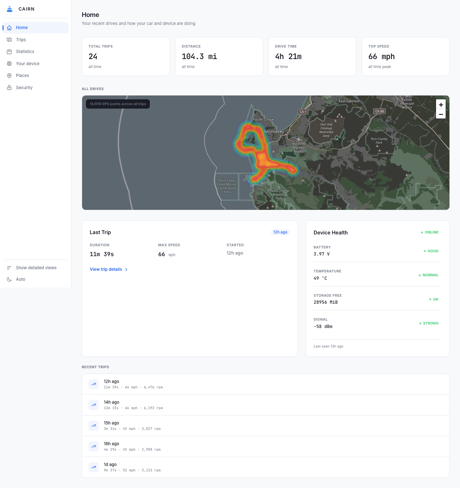

## Who it is for

The person who drives the car first, then other enthusiasts. The everyday pages (Home, Trips, Statistics, Places,
Your device, Security) are written in plain words and are all you see by default. The engine, turbo, fuel and
driving-style pages are for people who like to look inside the car; they are one click away under **Show detailed
views** and stay hidden otherwise.

**Where to start**

- *Just look around:* run the [demo](#run-it). It uses invented drives, so you need no car and no device.
- *Use it with your car:* you also need the [vehicle server](https://github.com/ParkWardRR/cairn-vehicle-server)
  and its `cairn-tsdb` store. This site reads that store and never writes to it. The
  [front-door repository](https://github.com/ParkWardRR/cairn-driving-log-selfhosted) explains the whole setup,
  including the dongle and the iPhone app.
- *Put it on a server you already have:* see [Deploy](#deploy) and [Authentication](#authentication).

## What is in this repository

A [Nuxt](https://nuxt.com) 4 app (Vue 3, Pinia, Tailwind, ECharts, Leaflet) with a small server layer in front of
the store. The server layer does four jobs: it asks the store for trips and statistics, it authenticates every
request, it names the places you stop at, and it keeps the few things you make yourself (named places, trip notes).
There is also a small Go tool, `cairn-fsq`, for loading an offline place dataset.

## Page by page

Simple pages are always in the sidebar. Detailed pages appear after **Show detailed views** (and stay visible while
you are on one). Light, dark and automatic themes are in the sidebar footer.

| Page | View | What it shows |
| --- | --- | --- |
| **Home** (`/`) | simple | Totals (trips, distance, drive time, top speed), a heat map of every drive, the last trip, device health, recent trips. Detailed views add engine highlights (peak boost, top RPM, air-fuel balance, fuel trims). |
| **Trips** (`/trips`) | simple | Every drive, newest first, with search: free text over your notes, tags and the names of saved places a trip visited; filter by tag, bookmark or date range. |
| **Trip** (`/trips/<id>`) | simple | One drive: route on a map coloured by speed (the dongle's GPS and the phone's combined, or either alone, or both lines over each other), playback scrubber, stops (with icons for the kind of place), GPS health, **GPS: device and phone** (how the two differed and how close each came to the car's own speed and distance), speed and elevation, estimated fuel use, "trip insights" cards, bookmark/tags/note, and **Save a picture**. |
| **Statistics** (`/stats`) | simple | Trips, distance, time driving and top speed for a week, month, quarter, year or custom range, compared with the period before, with a distance chart with no gaps. |
| **Places** (`/places`) | simple | A map and list of where you stopped and where trips started and ended. Name them, pick a kind, confirm or remove the ones the system learned; export and import. |
| **Your device** (`/system`) | simple | Battery, signal, temperature, storage, last contact, the uploads (bundles) that have arrived and the state of the store behind the site. |
| **Security** (`/security`) | simple | Your passkeys, adding and removing them, a download of everything you made, restore from a file, the recent-activity trail, sign out. |
| **Engine details** (`/analytics`) | detailed | Speed, revs, temperatures and more for one chosen drive. |
| **Turbo** (`/boost`) | detailed | Boost curve, intake air temperature against boost, timing under boost, full-throttle pulls. |
| **Fuel mix** (`/fuel`) | detailed | Ethanol blend, fuel flow, lambda against load, long- and short-term fuel trims by trip and by RPM/load. |
| **Fuel economy** (`/economy`) | detailed | Estimated MPG against speed and RPM, tuning efficiency, economy by trip. Clearly labelled as estimates. |
| **Driving style** (`/behavior`) | detailed | G-force and vibration distributions and a per-trip list. |
| **Speedometer check** (`/calibration`) | detailed | Whether the car's own speed agrees with GPS. |

Everything is read from the store, so a page is empty (with a sentence saying what it needs) until a drive with the
right readings has arrived. With no store reachable the API answers 502 "store unreachable" rather than showing
zeros.

### Screenshot gallery

All screenshots are taken by `scripts/screenshots.mjs` over the invented demo store (drives around a made-up
route), in light mode. There are no screenshots yet of the sign-in, Security or Fuel economy pages.

| | |
| --- | --- |
| 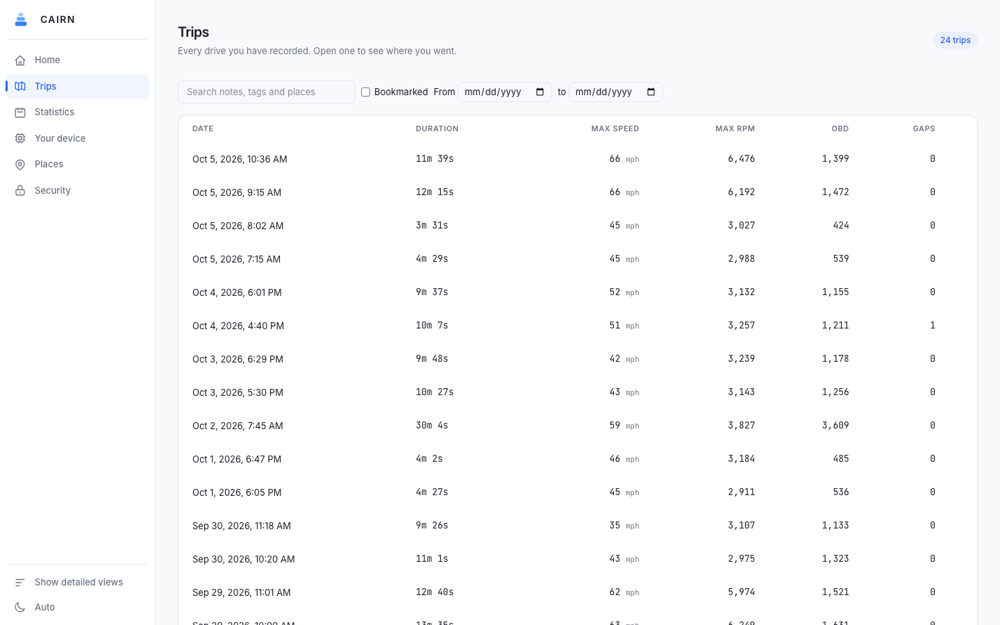 **Trips** |  **A trip** |
| 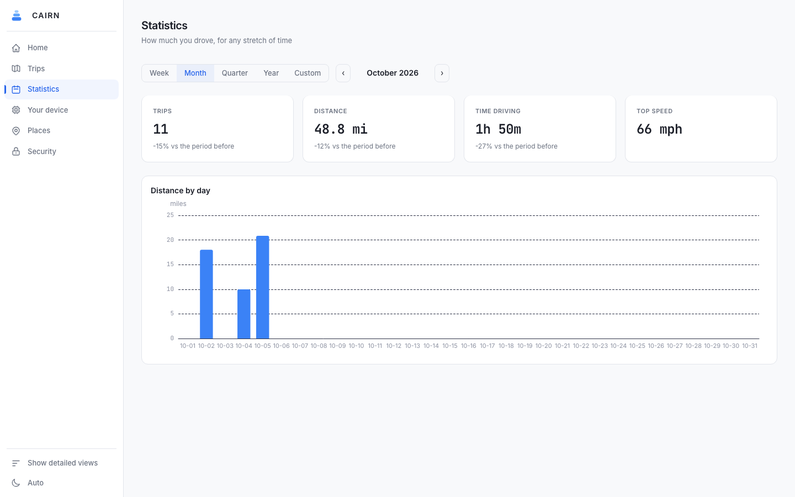 **Statistics** |  **Places** |
| 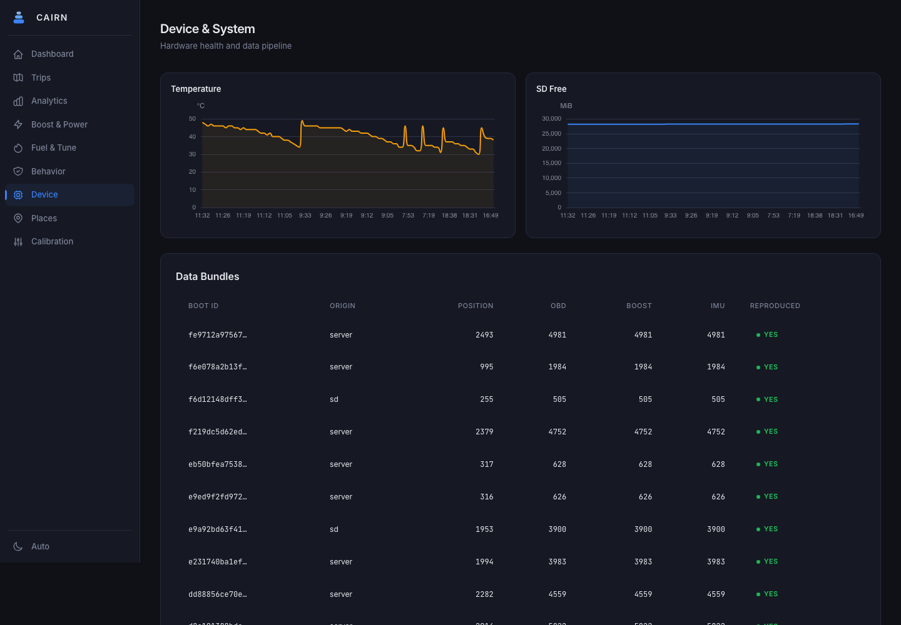 **Your device** | 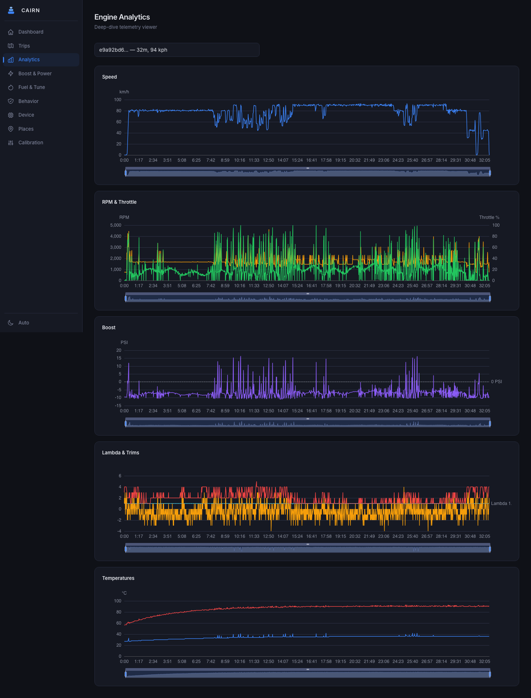 **Engine details** (detailed) |
| 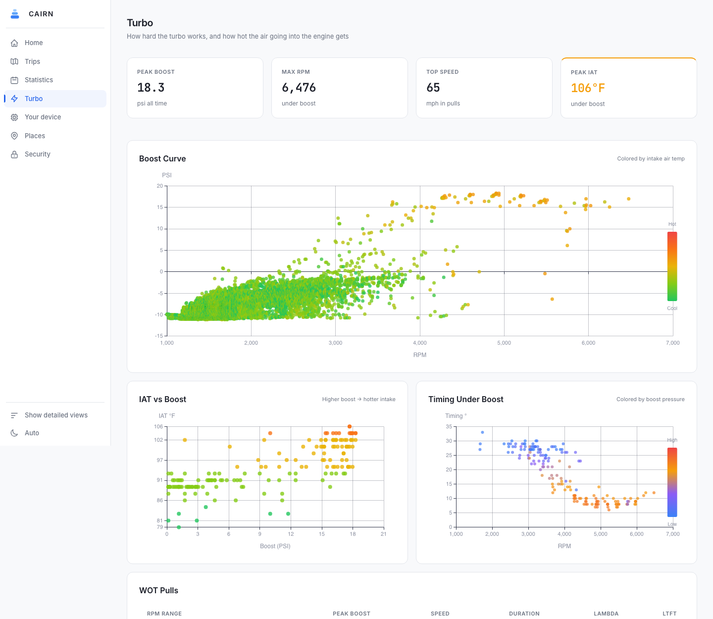 **Turbo** (detailed) | 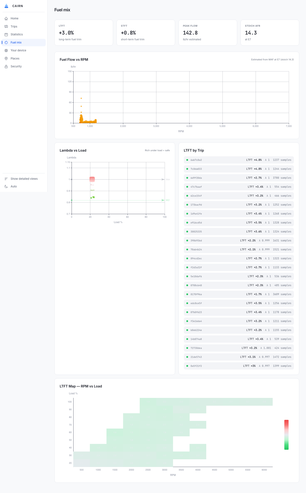 **Fuel mix** (detailed) |
| 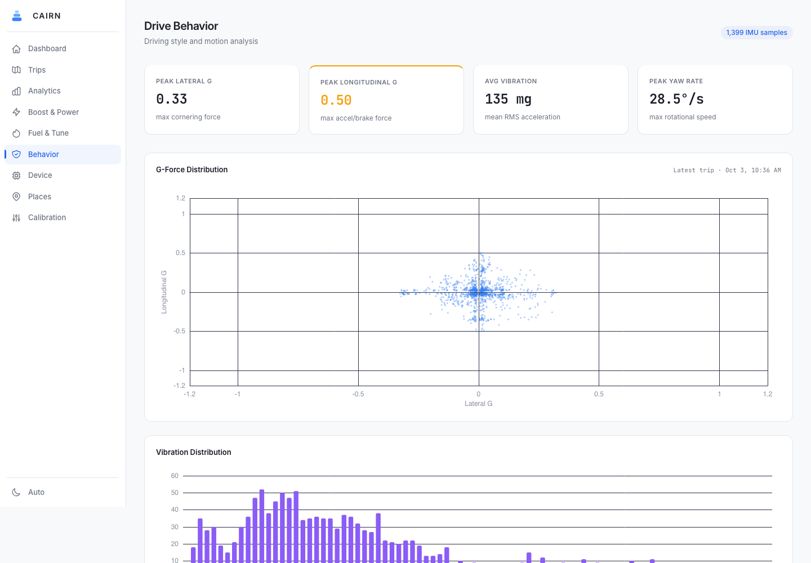 **Driving style** (detailed) |  **Speedometer check** (detailed) |

## How it fits together

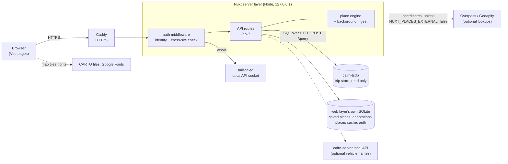

- The **store** (`cairn-tsdb`, from the vehicle server) holds the trips. The web layer sends it SQL over HTTP
  (`POST /query`) against the views and tables of the `store/v1` contract and never writes. The only other calls
  are `/healthz` and `/snapshot`.
- The **web layer's own SQLite files** hold only things the store cannot know: what you named and noted, a place
  lookup cache and visit history, and sign-in state. See [Your data](#your-data).
- The server listens on **loopback only** (`NITRO_HOST=127.0.0.1`); Caddy is the only way in. That matters for
  sign-in: Caddy tells the service which address it is proxying for, and only a loopback peer is believed.
- A background task inside the server (a minute after start, then every minute, and only doing work when the trips
  changed) records each trip's stops, names the places and learns repeat places. See [docs/places.md](docs/places.md).
- Pages are rendered on the server, so the server asks its own API for data using the identity already
  established for the page request. A browser cannot forge that.

## Authentication

Every page and every route needs an identity, and an anonymous caller gets nothing but the sign-in page. There are
three kinds of identity, and **both human ones are supported at the same time**: a **passkey** and a **Tailnet
identity**. A request needs only one of them. No cloud account is involved in either.

| Identity | How it is proven | What it can do |
| --- | --- | --- |
| **Passkey session** | A WebAuthn sign-in (Touch ID, Face ID, a security key, a phone) starts a session cookie lasting 30 days (`NUXT_AUTH_SESSION_DAYS`). | Everything. The only identity that can be *fresh* (see below). |
| **Tailnet device** | The request's client address belongs to a device owned by a login in `NUXT_AUTH_TAILNET_USERS`, as reported by the local `tailscaled`. | Read everything and change saved places and trip marks. Cannot manage passkeys or read the audit trail. |
| **Service token** | `Authorization: Bearer <token>`. For the deploy check and staging. | Read only (GET, HEAD, OPTIONS). Refused (403) on the people-only routes `/api/auth/passkeys` and `/api/auth/audit`. |

`NUXT_AUTH_MODE=off` opens every route; it exists for local development only and the service warns loudly at
start. Any other value (the default is `required`) means authentication is on.

### Which identity applies

Checked in this order (`server/middleware/auth.ts`, `server/utils/auth.ts`):

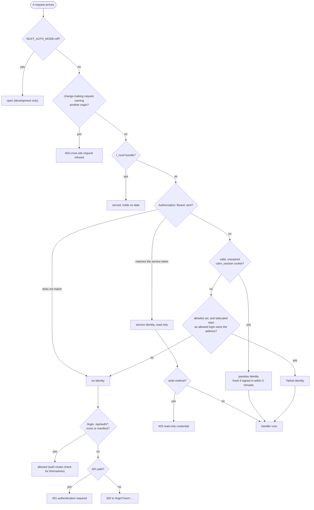

A wrong bearer token does not fall through to a cookie or Tailnet identity; it is simply no identity. A stale or
unknown session cookie does fall through, so a device on your tailnet is still recognised after its session
expires.

### Passkey sign-in

Passkeys use `@simplewebauthn`. User verification is required, attestation is not requested, and resident keys are
preferred (so a password manager can offer the passkey). There is one owner and one WebAuthn user; every passkey
belongs to it. Challenges live in memory for two minutes and are single use whether or not the response verifies.
A passkey only works on the origin(s) in `NUXT_AUTH_ORIGINS` (the browser enforces this), over HTTPS.

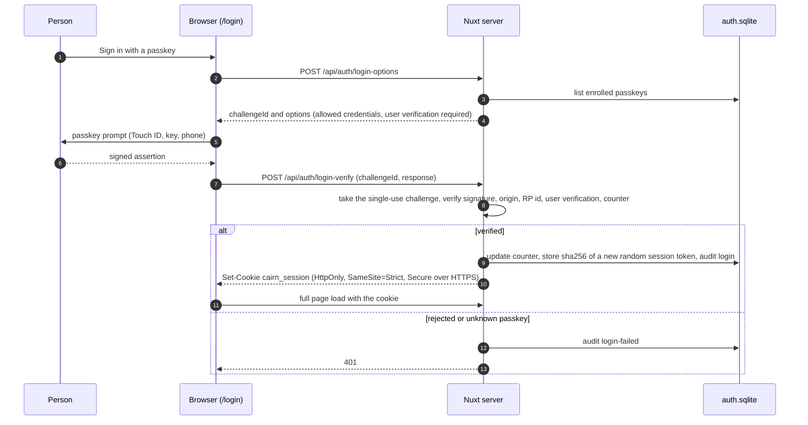

Details worth knowing:

- Only a **hash** of the session token is stored, so a copy of `auth.sqlite` cannot be replayed.
- Failed attempts are counted per client address: ten failures in five minutes blocks that address with a 429
  until the window passes; a success clears the count.
- A session is **fresh** for five minutes after the passkey was used. Actions that change how you sign in need a
  fresh session. The Security page handles this for you: it asks for the passkey again and retries.
- Adding a passkey needs a fresh passkey session. Removing one needs the same and ends every session that passkey
  started, so a lost device is locked out immediately.

### Tailnet identity

The server asks the local `tailscaled` (its LocalAPI unix socket, `NUXT_AUTH_TAILSCALE_SOCKET`) who owns the
client address, and accepts the answer only if the owning login is in `NUXT_AUTH_TAILNET_USERS` (comma-separated,
compared case-insensitively). Tagged devices have no user and never match. Answers are cached for 60 seconds per
address.

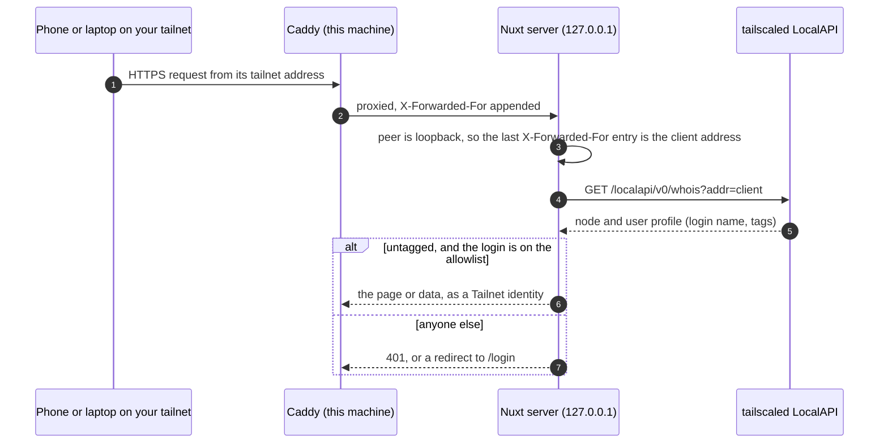

Why the address can be trusted: the service listens on loopback only, and the server believes `X-Forwarded-For`
only when the TCP peer is itself loopback, so a LAN client cannot claim another address. For recognition to work,
the request must actually reach Caddy over the tailnet. If the site's name resolves to a LAN address, a phone on
home Wi-Fi arrives as a LAN client and is not recognised (use a passkey from there).

A Tailnet identity is *ambient*: it belongs to the machine, not to a person's deliberate act. That is why it can
read and edit places but can never enrol or remove a passkey.

### First passkey

Until a passkey exists, the login page says so and offers the two ways to create the first one:

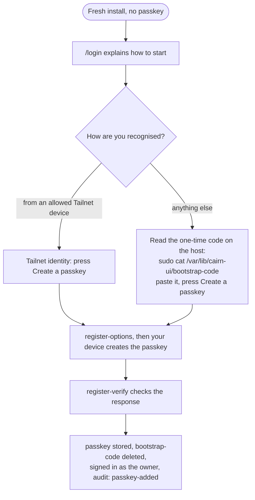

The code is deliberate: without it, whoever reached a fresh install first would own it. It is a random value
written to `bootstrap-code` in the state directory (mode 0600, so only the service user and root can read it) when
the service starts with no passkey, never to the log. `NUXT_AUTH_BOOTSTRAP_CODE` can set it instead. The file is
deleted when the first passkey exists. A refused first enrolment is recorded in the audit trail
(`enrol-refused`). If the device is on a tailnet but its login is not on the allowlist, the sign-in page says so.
Every later passkey needs a fresh passkey session.

### Service token

A random 32-byte token is created on first use and kept in `service-token` in the state directory (mode 0600), or
set with `NUXT_AUTH_SERVICE_TOKEN`. Comparison is constant time. It is read only by policy: the deploy script reads
the file as root on the host and uses it to walk every GET route; staging uses a generated one. Scripts pass it to
curl through its config input, so it never appears in a process listing.

### Cross-site requests and the audit trail

- A request that changes something and names another origin (`Origin`, `Sec-Fetch-Site`) is refused with 403,
  even from a Tailnet address. Mutating endpoints also accept `application/json` only (415 otherwise), which a
  cross-site form cannot send without a CORS preflight the server never grants. Session cookies are `HttpOnly`
  and `SameSite=Strict`.
- The **audit trail** (`GET /api/auth/audit`, shown on the Security page, newest 200) records who, by which
  method, when and which action: `login`, `login-failed`, `logout`, `passkey-added`, `passkey-removed`,
  `enrol-refused`, `enrol-failed`. It records names, never values. Edits to places and trip marks are not audited
  today.
- `requireFresh(event)` exists for routes that will take a secret or change configuration: it demands a fresh
  passkey, so neither a Tailnet identity nor the service token is ever enough. Today only passkey management uses
  it; it is the gate the planned Wi-Fi/LTE settings need (see [Status](#status)).

More in [docs/auth.md](docs/auth.md).

## Privacy

What leaves the machine, and when:

| What | Where to | When | How to stop it |
| --- | --- | --- | --- |
| Map tiles (the area you are looking at) | CARTO basemaps (`basemaps.cartocdn.com`) | Maps on Home, a trip and Places | Not configurable. `NUXT_PUBLIC_CARTO_KEY` adds your key to the tile URL. |
| Web fonts (Inter, JetBrains Mono) | Google Fonts | Every page load, from the browser | Not configurable today; the fonts are linked in `nuxt.config.ts`. |
| Coordinates of a stop, to find its name | Overpass (OpenStreetMap) servers; Geoapify if `NUXT_GEOAPIFY_KEY` is set | In the background, once per new unknown spot (cached), never for a place you saved or that was learned | `NUXT_PLACES_EXTERNAL=false`. Cached names and a local Foursquare extract keep working. |
| Nothing | | Saving a picture of a trip | Nothing is sent: it is drawn in your browser with no tiles. |

The place engine spaces its Overpass requests a few seconds apart, keeps within a daily Geoapify budget, and shows
the attribution the sources require. Vehicle names come from the vehicle server's loopback API if
`NUXT_CAIRN_LOCAL_URL` is set; only a display name and engine code are copied out of its answer, so anything else
it sends (a VIN, say) never reaches the browser.

### Pictures, with redaction

A trip page can save a PNG of the route (1600, 3200 or 4800 px wide). The server prepares the data
(`/api/trips/<id>/image-data`) and **redacts it before it leaves the server**, with the same rules for any output
(`shared/utils/redact.ts`):

- Every point within the true start and the true end of the trip, by straight-line distance, is removed, even if
  the route later passes back by. At least 300 m and at most 2000 m (`?trim=`); there is no way to ask for less.
- Every point inside a saved place of a private kind (home, work, school, health, friends, worship) plus a 100 m
  margin is removed wherever it falls, and the route is split there rather than joined across.
- Only position and speed survive. No times, ids or other coordinates are carried. A trip too short to draw
  without showing where it started and ended produces no picture.

Redaction follows the places you have saved, confirmed or had learned, so mark Home and Work for it to cover them.
This is a way to share a picture with less exposure, not a promise that a route cannot be recognised from its shape.

## Your data

The web layer keeps what you make in `/var/lib/cairn-ui/` (`NUXT_PLACES_DATA_DIR`). Every store, and how to get it
out and back in:

| Store | What | Export | Restore | Rebuilt if lost? |
| --- | --- | --- | --- | --- |
| `saved-places.sqlite` | places you named or confirmed, places learned from repeat visits, spots you rejected | Places page ▸ Export, or `GET /api/places/saved/export` | Places page ▸ Import (a merge: places already there are skipped); a lost database is restored from `saved-places.json` on start | No |
| `annotations.sqlite` | bookmarks, tags and notes on trips | `GET /api/annotations/export` | `POST /api/annotations/import` (a merge: older never overwrites newer); restored from `annotations.json` on start | No |
| both of the above | | Security page ▸ Download everything, or `GET /api/data/export` (one file) | Security page ▸ Restore from a file, or `POST /api/data/import` (both parts checked as a whole before anything changes; safe to repeat) | No |
| `places.sqlite` | lookup cache and visit history | not needed | none | Yes: names are looked up again, visits rebuilt from the trips in the store |
| `auth.sqlite` | passkeys (public keys), session hashes, the audit trail | included in `deploy-ui.sh --snapshot` (root-only) | restore the snapshot, or create a passkey again (see [First passkey](#first-passkey)) | Passkeys can be re-enrolled; sessions are simply signed out |
| `service-token`, `bootstrap-code` | the read-only token; the one-time enrolment code (only while there is no passkey) | n/a | regenerated on start | Yes |
| `fsq-pois.ndjson` (optional) | an offline place extract made by `cairn-fsq` | n/a | run `cairn-fsq` again | Yes |

The trips themselves are not here: they live in the vehicle server's store, which has its own backups.

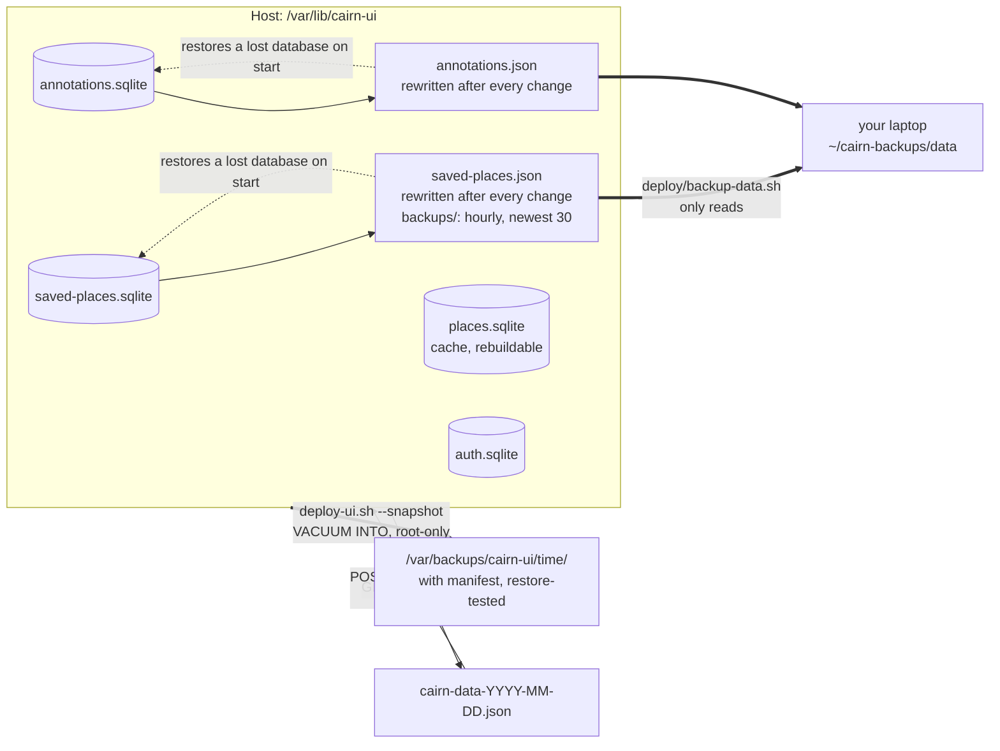

`deploy/backup-data.sh` copies the JSON mirrors and the dated copies to your laptop; it only reads and is safe to
schedule. A snapshot before a deploy (`deploy-ui.sh --snapshot`) copies every store plus the deployed build, and
restore-tests the copy (integrity, row counts, hashes). These files hold real locations (home included): keep them
out of version control.

## Places

Stops and trip starts and ends become places you can name and correct. A place you saved or the system learned is
used before anything else; otherwise the name comes from OpenStreetMap, Geoapify (needs a key) and an optional local
Foursquare extract, and is cached. A spot that appears on three or more trips with a specific name and a confidence
of at least 0.5 is saved automatically as **learned**; edit or confirm it and it is yours; remove it and it is
remembered as rejected so it is not learned again. Kinds (Home, Work, Gym, Food, Fuel and so on) pick the icon and
rank the suggested names. The engine only ever *suggests* Home. Everything is in [docs/places.md](docs/places.md).

## Run it

You need Node.js 22 or newer (the server uses the built-in `node:sqlite`).

```sh
npm ci
NUXT_AUTH_MODE=off NUXT_TSDB_URL=http://127.0.0.1:8480 npm run dev
```

`NUXT_AUTH_MODE=off` is needed for local development because the site otherwise requires a passkey or a Tailnet
identity, even on your own machine. Never set it on a reachable host.

**Demo with invented data.** From the [vehicle server repository](https://github.com/ParkWardRR/cairn-vehicle-server):

```sh
go run ./cmd/cairn-tsdb-demo        # serves a synthetic store on 127.0.0.1:8480
```

Then start the site as above. `go run ./cmd/cairn-tsdb-demo -empty` serves the same schema with no rows.

Place naming sends coordinates to Overpass (and Geoapify, if a key is set). Set `NUXT_PLACES_EXTERNAL=false` to keep
every coordinate local.

## Configuration reference

Nuxt turns each runtime-config key into an environment variable (`tsdbUrl` becomes `NUXT_TSDB_URL`). On a host they
live in `/etc/cairn/ui.env`, never in this repository (`deploy/systemd/ui.env.example` is the template).

| Variable | Default | What it does |
| --- | --- | --- |
| `NUXT_TSDB_URL` | `http://127.0.0.1:8480` | The `cairn-tsdb` store (loopback). |
| `NUXT_CAIRN_LOCAL_URL` | empty | The vehicle server's loopback local API, for vehicle display names. Empty means ids only. |
| `NUXT_PLACES_EXTERNAL` | `true` | Set to `false` to stop every lookup that sends coordinates off the machine. |
| `NUXT_PLACES_DATA_DIR` | `.data/places` (the deploy drop-in sets `/var/lib/cairn-ui`) | Where every store above lives. |
| `NUXT_OVERPASS_URL` | two public Overpass servers, comma-separated | Overpass endpoints to try, in order. |
| `NUXT_GEOAPIFY_KEY` | empty | Enables Geoapify lookups (free plan; the UI shows the required credit). |
| `NUXT_PUBLIC_CARTO_KEY` | empty | Appended to map tile requests when set. |
| `NUXT_AUTH_MODE` | `required` | `off` opens every route. Development only. |
| `NUXT_AUTH_ORIGINS` | empty | Public origin(s) people type, with scheme, e.g. `https://cairn.example.lan`. Required for passkeys; empty only works on `localhost`. |
| `NUXT_AUTH_RP_ID` | host of the first origin | The WebAuthn relying-party id. |
| `NUXT_AUTH_TAILNET_USERS` | empty | Comma-separated Tailnet logins recognised by their device's address. Empty means passkeys only. |
| `NUXT_AUTH_TAILSCALE_SOCKET` | `/var/run/tailscale/tailscaled.sock` | The `tailscaled` LocalAPI socket. |
| `NUXT_AUTH_SESSION_DAYS` | `30` | Passkey session length. |
| `NUXT_AUTH_DATA_DIR` | empty (the places data directory) | Where `auth.sqlite`, `service-token` and `bootstrap-code` live. |
| `NUXT_AUTH_SERVICE_TOKEN` | empty (generated into a file) | Sets the read-only service token. |
| `NUXT_AUTH_BOOTSTRAP_CODE` | empty (generated into a file) | Sets the one-time enrolment code. |
| `NITRO_PORT`, `NITRO_HOST` | Nitro defaults; the unit sets `3000` and `127.0.0.1` | Where the Node server listens. Keep it on loopback behind Caddy. |
| `CAIRN_SQL_LOG` | unset | Staging only: a file that records every statement sent to the store. |

Deploy and test scripts also read `CAIRN_DEPLOY_HOST` (or `CAIRN_HOST` for `backup-data.sh`), `CAIRN_TOKEN` and
`CAIRN_TOKEN_FILE`, `CAIRN_SERVER_DIR`, `CAIRN_STAGING_PORT_BASE` and `CAIRN_STAGING_NO_BUILD`; each is described in
its script header.

## API overview

56 routes under `server/api`, listed in `tests/routes.json` (generated by `tests/routes.json.sh`; a unit test fails
if it drifts from `server/api`). All need an identity except `/api/auth/*`, which checks inside each handler. Most
accept `?vehicle=<32-hex id>`; the analysis routes answer for exactly one car and default to the most recently seen.

| Area | Routes |
| --- | --- |
| Trips | `GET /api/trips`, `/api/trips/search`, `/api/trips/:bootId` and, under it, `events`, `fuel`, `image-data`, `insights`, `route`, `stops`, `telemetry`, `timeline` |
| Statistics and dashboard | `GET /api/stats/period`, `/api/dashboard/{stats,recent,highlights,device}`, `/api/heatmap` |
| Analytics | `GET /api/analytics/{boost-curve,boost-detail,drive-summary,fuel-economy,fuel-health,imu,pulls,speed-agreement,telemetry,trim-map}` |
| Device and store | `GET /api/device/{bundles,health,reproducibility,tsdb-status}`, `/api/vehicles`, `/api/snapshot` (Parquet pass-through from the store) |
| Places | `GET /api/places`; `POST /api/places/saved`; `PATCH` and `DELETE /api/places/saved/:id`; `GET /api/places/saved/export`; `POST /api/places/saved/import` |
| Trip marks | `GET /api/annotations`; `GET`, `PUT`, `DELETE /api/annotations/:bootId`; `GET /api/annotations/export`; `POST /api/annotations/import` |
| Your data | `GET /api/data/export`; `POST /api/data/import` |
| Auth | `GET /api/auth/session`; `POST /api/auth/{login-options,login-verify,register-options,register-verify,logout}`; `GET /api/auth/passkeys`; `DELETE /api/auth/passkeys/:id`; `GET /api/auth/audit` |

Bad input answers 400 with a plain message; a store that is down answers 502 `store unreachable`; an empty store
answers with empty lists and zero totals rather than errors. There is no generic SQL passthrough route (it was
removed).

## Test

```sh
npx vitest run                                # unit tests, including the route inventory check
tests/staging.sh                              # staged acceptance: every route, five scenarios, over the demo store
tests/walk-routes.sh http://localhost:3000    # every GET route against a running instance (needs a token)
(cd tools/cairn-fsq && go test ./...)         # the command-line place-extract tool
```

- **Unit tests** cover the auth policy and store, places (resolver, labels, learning, saved places, kinds), stops,
  periods, annotations, redaction, vehicle scoping and the route inventory.
- **Staged acceptance** (`tests/staging.sh`) builds the production bundle, builds the synthetic demo store from the
  exact vehicle-server commit in `server.lock`, and starts, on spare loopback ports, the store with data, the store
  with no rows, and three web instances (over data, over the empty store, over a missing store). It runs
  `tests/acceptance` in five scenarios: representative data, empty store, bad input, missing store and access
  control. Access control is exercised end to end, with a virtual WebAuthn authenticator for passkeys and a fake
  `tailscaled` socket for Tailnet identity. It also fails if a route in the inventory was never exercised. Nothing
  touches a real store or host. It needs Node, Go and git on the machine that runs it.
- `tests/staging.sh --run CMD` runs a command against the staged instances (this is how the screenshots are taken,
  with `scripts/screenshots.mjs`); `--capture` also rewrites `deploy/required-queries.json`.
- CI (`.github/workflows/ci.yml`) runs on a self-hosted runner: a runner-policy check, unit tests plus build,
  staged acceptance (and a check that `deploy/required-queries.json` is current), and `go vet` and `go test` for
  `cairn-fsq`.

## Deploy

`deploy/deploy-ui.sh` builds this repository's own `HEAD` (or the working tree with `--dirty`) and installs it on a
host as the `cairn-ui` systemd service. The target comes from `CAIRN_DEPLOY_HOST` or a gitignored `deploy.env`; the
real Caddy site goes in a gitignored `deploy/caddy/Caddyfile` (copy `Caddyfile.example`). No host name is stored in
this repository.

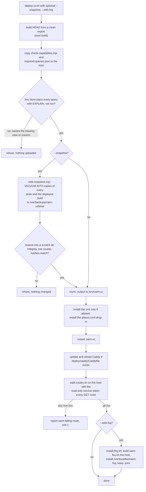

- **EXPLAIN gate.** `deploy/required-queries.json` is the SQL the web layer sent the demo store during staging,
  with ids and dates normalised. `deploy/check-capabilities.mjs` has the *live* store plan each one (`EXPLAIN`,
  nothing is run, no data is read) and refuses the deploy if it cannot, quoting the store's own error. CI fails if
  the file is stale (`tests/staging.sh --capture` regenerates it).
- **Snapshot and restore test.** `--snapshot` takes consistent copies while the service is running, restores them
  into a scratch directory, opens every restored store and compares integrity, row counts and hashes with a
  manifest. A snapshot that does not restore stops the deploy.
- **Route walk.** After the restart, every GET route in `tests/routes.json` is fetched on the host with the
  service token. Anything not 2xx fails the deploy, except that a store with no trips legitimately answers 400, 404
  or 503 on the trip routes (`--detect-empty`). The people-only auth routes must answer 403 to the token.
- **`cairn-fsq`** is a Go tool that extracts a bounding box of the gated Foursquare OS Places dataset (Apache-2.0,
  needs a Hugging Face token) into `fsq-pois.ndjson`, which the place engine loads from the data directory. DuckDB
  links through cgo, so `deploy/install-fsq.sh` builds it on the host (go and gcc required).
- **Caddy.** `deploy/caddy/Caddyfile.example` terminates HTTPS and proxies to `localhost:3000`, with security
  headers and long caching for `/_nuxt/*`. It is an example from the author's setup (DNS-01 certificates through
  Cloudflare); use your own TLS. It must reach the service over loopback so that the forwarded client address is
  believed.
- The systemd unit is installed only when absent, because the live one carries host-specific settings.

## What it is pinned to

`contracts.lock` pins the protocol release: contracts tag `contracts-v0.1.0` of the front-door repository (and the
commit it must resolve to), with the store protocol `store/v1`. `scripts/fetch-contracts.sh` fetches and verifies it.
`server.lock` records the vehicle-server revision this layer was last checked against and the contract it requires
of it: a compatible store schema, not "a server at least this new". There is no server release yet, so `tag` is
empty and the commit is the pin; staged acceptance builds the demo store from exactly that commit.

## Status

| | |
| --- | --- |
| **Shipped and tested** | Every page above, over the pinned demo store, in staged acceptance (data, empty, bad input, store missing). Authentication in all three forms, including the first-passkey flow, a second passkey needing a fresh session, cross-site refusal and the audit trail, with virtual-authenticator and fake-`tailscaled` tests. Statistics for any period; bookmarks, tags, notes and search; places with learning; data export and import; picture export with redaction; the EXPLAIN gate, snapshot with restore test and post-deploy route walk. |
| **Deployed** | Running on the author's home server behind Caddy, deployed with `deploy-ui.sh`. Your own deployment is yours to verify; the staged suite is what CI proves. |
| **Planned, not built** | **Wi-Fi and LTE settings for the dongle in the web UI** ([web #16](https://github.com/ParkWardRR/cairn-vehicle-web-dashboard/issues/16)). It had to wait for authentication ([web #15](https://github.com/ParkWardRR/cairn-vehicle-web-dashboard/issues/15)), which now exists, with the fresh-passkey gate it will use. No settings page or route exists yet, and the configuration contract, server support and firmware receiver it depends on are tracked in the front-door [ROADMAP](https://github.com/ParkWardRR/cairn-driving-log-selfhosted/blob/main/ROADMAP.md). **Sharing** trips beyond the redacted picture (a portable file with redaction, never a hosted service) waits on its threat model and the reserved `share/v1` contract. Vehicle-insight work (a tune record, baselines, a plain health summary) is on the roadmap, not here. |
| **Limits today** | One owner: every passkey belongs to the same person. Figures are shown in US units. Edits to places and trip marks are not in the audit trail. |

## Repository layout

```
app/                 Vue pages, components, composables and Pinia stores
  pages/               one file per page (login, security, trips/[bootId], ...)
  components/          charts, maps, data cards, layout, trip widgets
server/
  api/                 the routes (file name gives method and path)
  middleware/auth.ts   identity and cross-site check for every request
  plugins/             auth start-up notes, background place ingest
  utils/               auth, place engine, tsdb client, annotations, stops
shared/utils/        code used by browser and server: periods, place kinds, redaction
deploy/              deploy-ui.sh, backup-data.sh, install-fsq.sh, snapshot and capability
                     checks, required-queries.json, systemd units, Caddyfile.example
tests/               unit tests, acceptance suite, staging.sh, walk-routes.sh, routes.json
tools/cairn-fsq/     Go tool: offline place extract (its own module)
scripts/             fetch-contracts.sh, screenshots.mjs
docs/                auth.md, places.md, screenshots/
contracts.lock, server.lock, MIGRATION.md, .github/workflows/ci.yml
```

## Docs

- [docs/auth.md](docs/auth.md): sign-in, passkeys, Tailnet identity, the service token
- [docs/places.md](docs/places.md): how places are named, learned and stored
- [MIGRATION.md](MIGRATION.md): where this repository's history came from (the original monorepo)
- [Front door](https://github.com/ParkWardRR/cairn-driving-log-selfhosted): architecture, ROADMAP, threat model, shared contracts

## Troubleshooting

- **Every page redirects to `/login`.** Expected: nothing is shown without an identity. Sign in with a passkey, or
  see [First passkey](#first-passkey). For local development only, `NUXT_AUTH_MODE=off`.
- **"passkeys are not configured (set NUXT_AUTH_ORIGINS)" (503).** Set it to the exact address you type, with
  scheme, e.g. `https://cairn.example.lan`. Passkeys also need HTTPS (or `localhost`).
- **"This browser cannot use passkeys here."** The page is not on a secure origin, or the browser lacks WebAuthn.
- **I am on my tailnet but I am asked for a code.** Your Tailscale login is not in `NUXT_AUTH_TAILNET_USERS`, or the
  request reached Caddy over the LAN rather than the tailnet (the site's name resolves to a LAN address), or the
  `tailscaled` socket path is wrong or unreadable by the service user. The sign-in page says when the device is on
  a tailnet but not allowed.
- **I lost every passkey.** Adding a passkey needs an existing one, so start over: stop the service, move
  `auth.sqlite` aside (this also signs everyone out and clears the audit trail), start the service, and enrol again
  from an allowed Tailnet device or with the new `bootstrap-code`.
- **429 "too many attempts".** Ten failed sign-in or enrolment attempts from one address within five minutes. Wait.
- **Routes return 502 `store unreachable`.** `NUXT_TSDB_URL` does not point at a running `cairn-tsdb`.
- **A page is empty.** The store has no drive with the readings that page needs yet; the empty-state text says
  which. Boost needs full-throttle pulls, fuel pages need airflow readings, and so on.
- **Place names stay "pending" or never appear.** Lookups run in the background, one at a time, and are off when
  `NUXT_PLACES_EXTERNAL=false`. Without a Foursquare extract nothing can name a place offline.
- **A deploy refuses with a missing view or column.** The live store is older than this build. Update the vehicle
  server (see `server.lock`), or deploy an older build.

## FAQ

**Can it write to my trip data?** No. It sends only reads to the store. What you make (names, notes, tags) is kept
in the web layer's own files.

**Do I need Tailscale?** No. Passkeys alone are enough. Tailnet identity is an optional convenience so a phone or
laptop on your tailnet needs no sign-in. It never lets a device manage passkeys.

**Is the service token a way in for others?** It is read only, and only the deploy and test scripts use it. Treat
it like a password anyway.

**Can two people use it?** There is one owner. Everyone who signs in is that owner.

**Why does the site load fonts from Google and tiles from CARTO?** For appearance and maps. If that bothers you,
block those hosts or change `nuxt.config.ts`; see [Privacy](#privacy).

**Are the screenshots real drives?** No. They come from the demo store's invented drives.

## Contributing

Issues and pull requests are welcome. Run `npx vitest run` and `tests/staging.sh` before sending a change. Adding or
removing a route means running `tests/routes.json.sh` and committing the result; a change that alters the SQL sent
to the store means running `tests/staging.sh --capture` and committing `deploy/required-queries.json`. Keep real
host names, addresses, keys and personal locations out of the repository. CI runs on a self-hosted runner, and only
for branches of this repository (see `tests/check-runners.sh`).

## Related repositories

- [cairn-driving-log-selfhosted](https://github.com/ParkWardRR/cairn-driving-log-selfhosted): the front door, system docs and the shared contracts
- [cairn-vehicle-server](https://github.com/ParkWardRR/cairn-vehicle-server): the vehicle server and the `cairn-tsdb` store this site reads
- [cairn-esp32-device-firmware](https://github.com/ParkWardRR/cairn-esp32-device-firmware): the dongle firmware
- [cairn-ios-companion-app](https://github.com/ParkWardRR/cairn-ios-companion-app): the iPhone app

History before the split is preserved here; see [MIGRATION.md](MIGRATION.md). The legacy monorepo is archived as
[cairn-original-monorepo-archive](https://github.com/ParkWardRR/cairn-original-monorepo-archive).

## License

Blue Oak Model License 1.0.0, see [LICENSE](LICENSE).

## Two GPS tracks per trip

The dongle records its own GNSS fixes, and the phone's GPS when the Cairn app is connected (the app hands its fixes to
the dongle over Bluetooth; the store marks them with bit 5 of `source_flags`). A trip with both shows a **GPS** toggle
above the map: *Combined* (the default), *Device*, *Phone*, or *Both lines*.

- **Combined** is one point per second. Where both receivers have a fix in that second the two positions are averaged
  with weights of 1 / accuracy², so the better receiver counts for more; elsewhere it is whichever one had a fix. A
  receiver's own jumps (an implied speed over 200 km/h) are dropped first. A trip with one source shows that source's
  fixes unchanged.
- **GPS: device and phone** (under the map, `GET /api/trips/<id>/gps-compare`) lists each source's fixes, update rate,
  time with a fix, gaps, stated accuracy, distance, and speed and distance against the car's own OBD speed, then how
  the two differed: typical, 95th-percentile and largest gap in metres, the share within 5 m and 10 m, which way the
  phone sat relative to the device, and a chart over the trip.
- Position has no ground truth, so each receiver's accuracy is what it states (the dongle's from HDOP × 4 m when it
  states none, and the page says so), and the disagreement between the two is the measure. Speed and distance are
  checked against OBD, which is ground truth for those.
- Each device fix is compared with the phone's position *at the same instant*, interpolated between the phone's two
  nearest fixes; otherwise the delay the phone's fixes pick up crossing Bluetooth would show up as GPS error.
- Everything else on the trip page (distance, stops, elevation, fuel) reads a single track: the device's, or the
  phone's when the dongle never had a fix (`primaryPositions` in `server/utils/sql.ts`), so a road is never driven twice.
